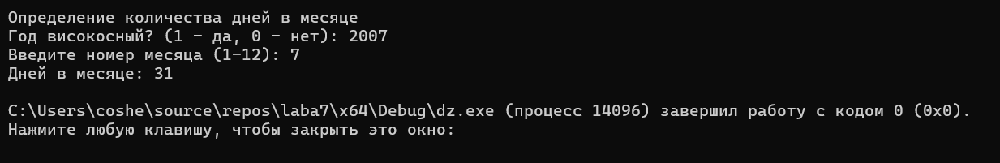

# Домашнее задание к работе 7
## Условие задачи
Составить программу, которая в зависимости от порядкового номера месяца выводит количества жней в этом месяце. Предусмотреть возможность выбора года(високосный или не високосный).
# 1. Алгоритм и блок-схема
### Алгоритм
1. Начало
2. Объявить константы:
   - month = переменная.
   - year = переменная.
3. Выводим результаты расчетов:
   -  printf("Определение количества дней в месяце\n");
   -  printf("Год високосный? (1 - да, 0 - нет): ");
   -  printf("Введите номер месяца (1-12): ");
   -  printf("Дней в месяце: %d\n", year ? 29 : 28);
   -  else if (month == 4 || month == 6 || month == 9 || month == 11)
printf("Дней в месяце: 30\n");
   -  else 
printf("Дней в месяце: 31\n");
4. Конец
### Блок-схема

## 2. Реализация программы:
   #define _CRT_SECURE_NO_WARNINGS
   #include <stdio.h>
   #include <locale.h>
   #include <math.h>
   int main() 
   {
    setlocale(LC_CTYPE, "RUS");
    int month, year;
    printf("Определение количества дней в месяце\n");

    printf("Год високосный? (1 - да, 0 - нет): ");
    scanf("%d", &year);

    printf("Введите номер месяца (1-12): ");
    scanf("%d", &month);

    if (month == 2) {
        printf("Дней в месяце: %d\n", year ? 29 : 28);
    }
    else if (month == 4 || month == 6 || month == 9 || month == 11) {
        printf("Дней в месяце: 30\n");
    }
    else {
        printf("Дней в месяце: 31\n");
    }
    return 0;
}
## 3. Результат работы программы

## 4. Информация о разработчике
Амелина Юлия, бИПТ-252
